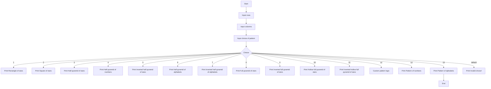

## Problem Analysis
The program generates various patterns based on user input, using loops for different designs.The available patterns include:

## Inputs
- **Rows**: The number of rows for the pattern (integer).
- **Columns**: The number of columns for patterns that require a rectangular or square layout (integer).
- **Choice**: The selected pattern type (integer between 1 and 14).

## Processes
1. **Rectangle of Stars**: Print a rectangle of stars using nested loops.
2. **Square of Stars**: Same as the rectangle, assuming rows = columns.
3. **Half Pyramid of Stars**: Incremental rows of stars.
4. **Half Pyramid of Numbers**: Incremental rows of numbers.
5. **Inverted Half Pyramid of Stars**: Decreasing stars in each row.
6. **Half Pyramid of Alphabets**: Incremental rows of alphabets.
7. **Inverted Half Pyramid of Alphabets**: Decreasing rows of alphabets.
8. **Full Pyramid of Stars**: Centered pyramid of stars.
9. **Inverted Full Pyramid of Stars**: Centered pyramid with decreasing rows.
10. **Hollow Full Pyramid of Stars**: Pyramid with stars only at edges and base.
11. **Inverted Hollow Full Pyramid of Stars**: Similar to the hollow pyramid but inverted.
12. **Custom Pattern**: Placeholder for user-defined patterns.
13. **Pattern of Numbers**: Rectangular grid of numbers.
14. **Pattern of Alphabets**: Rectangular grid of alphabets, looping after 'Z'.

## Outputs
The program outputs the selected pattern.

### Flowchart

