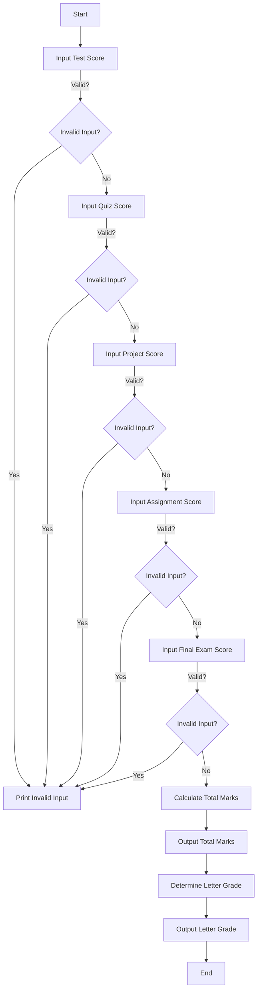

# Problem Analysis

The program calculates a student's total mark based on scores from various assessments and assigns a corresponding letter grade. The scores are weighted according to their contribution to the final grade. The program also includes input validation to ensure that the scores do not exceed their maximum allowable values.

## Algorithm

1. **Initialize** variables for scores and total mark.
2. **Input** the score for each assessment:
   - Test (15%)
   - Quiz (5%)
   - Project (20%)
   - Assignment (10%)
   - Final Exam (50%)
3. **Validate** each input to ensure it does not exceed the maximum allowed:
   - Test ≤ 20
   - Quiz ≤ 5
   - Project ≤ 20
   - Assignment ≤ 10
   - Final Exam ≤ 50
4. **Calculate** the total mark by summing all valid scores.
5. **Determine** the letter grade based on the total mark:
   - A+: 90+
   - A: 80-89
   - B+: 75-79
   - B: 60-74
   - C+: 55-59
   - C: 45-54
   - D: 30-44
   - F: Below 30
6. **Output** the total mark and letter grade.

#### Flowchart

