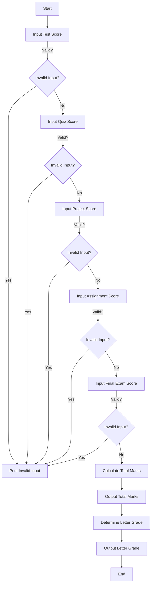

# Problem Analysis

The program calculates a student's total mark based on scores from various assessments and assigns a corresponding letter grade. The scores are weighted according to their contribution to the final grade. The program also includes input validation to ensure that the scores do not exceed their maximum allowable values.

## Algorithm

1. **Initialize** variables for scores and total mark.
2. **Input** the score for each assessment:
   - Test (15%)
   - Quiz (5%)
   - Project (20%)
   - Assignment (10%)
   - Final Exam (50%)
3. **Validate** each input to ensure it does not exceed the maximum allowed:
   - Test ≤ 20
   - Quiz ≤ 5
   - Project ≤ 20
   - Assignment ≤ 10
   - Final Exam ≤ 50
4. **Calculate** the total mark by summing all valid scores.
5. **Determine** the letter grade based on the total mark:
   - A+: 90+
   - A: 80-89
   - B+: 75-79
   - B: 60-74
   - C+: 55-59
   - C: 45-54
   - D: 30-44
   - F: Below 30
6. **Output** the total mark and letter grade.

### Pseudocode 
START
    
    DECLARE test, quiz, project, assignment, final_exam, total_mark AS DOUBLE
    
    DECLARE grade AS CHAR
    
    PRINT "Enter Test Score (out of 15%):"
    INPUT test
    IF (input is invalid OR test > 20) THEN
        PRINT "invalid input"
        RETURN 1
    ENDIF

    PRINT "Enter Quiz Score (out of 5%):"
    INPUT quiz
    IF (input is invalid OR quiz > 5) THEN
        PRINT "invalid input"
        RETURN 1
    ENDIF

    PRINT "Enter Project Score (out of 20%):"
    INPUT project
    IF (input is invalid OR project > 20) THEN
        PRINT "invalid input"
        RETURN 1
    ENDIF

    PRINT "Enter Assignment Score (out of 10%):"
    INPUT assignment
    IF (input is invalid OR assignment > 10) THEN
        PRINT "invalid input"
        RETURN 1
    ENDIF

    PRINT "Enter Final Exam Score (out of 50%):"
    INPUT final_exam
    IF (input is invalid OR final_exam > 50) THEN
        PRINT "invalid input"
        RETURN 1
    ENDIF

    total_mark = test + quiz + project + assignment + final_exam
    PRINT "Total Mark: ", total_mark

    IF (total_mark >= 90) THEN
        PRINT "A+"
    ELSE IF (total_mark >= 80) THEN
        PRINT "A"
    ELSE IF (total_mark >= 75) THEN
        PRINT "B+"
    ELSE IF (total_mark >= 60) THEN
        PRINT "B"
    ELSE IF (total_mark >= 55) THEN
        PRINT "C+"
    ELSE IF (total_mark >= 45) THEN
        PRINT "C"
    ELSE IF (total_mark >= 30) THEN
        PRINT "D"
    ELSE
        PRINT "F"
    ENDIF
END

#### Flowchart

