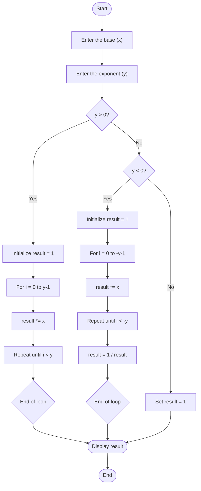

## Problem Analysis
The program calculates the power of a given base x raised to an exponent y using a loop-based approach.

Inputs:  
- x: The base number.
- y: The exponent.

Process:  
1. Initialize result to 1.
2. If y > 0: Multiply result by x repeatedly y times.
3. If y < 0: Multiply result by x repeatedly -y times, then compute the reciprocal of result.
4. If y == 0: Return 1 (since any number raised to the power of 0 is 1).

Output:  
- The value of x raised to the power y, printed in the format:  
  x raised to the power y is result

## Pseudocode

Step 1: Start the program.

Step 2: Initialize result to 1.

Step 3: Input the base x from the user.

Step 4: Input the exponent y from the user.

Step 5: Check if y > 0:
  - Repeat the following y times:
  - Multiply result by x.

Step 6: Else if y < 0:
  -  Repeat the following -y times:
  - Multiply result by x.
  - Set result to 1 / result.

Step 7: Else if y == 0:
 - Set result to 1.

Step 8: Output x raised to the power y is result.

Step 9: End the program.
## flowchart

