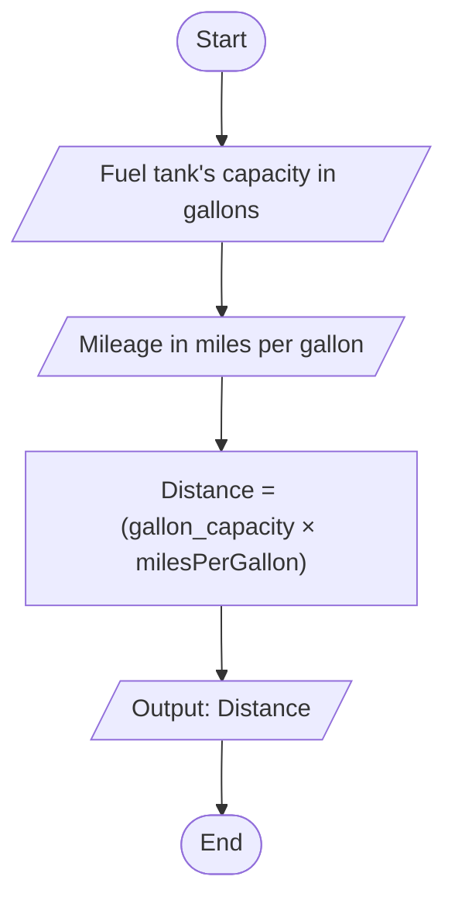

# Problem Analysis

The program calculates how far a car can travel on a full tank of gas based on user input for the fuel tank's capacity in gallons and the car's mileage in miles per gallon.

1. **Inputs**:
   - `gallon_capacity`: The capacity of the car's fuel tank in gallons.
   - `milesPerGallon`: The distance the car can travel per gallon of gas (mileage).

2. **Processing**:
   - Compute the total distance using the formula:  
     `distance = gallon_capacity × milesPerGallon`

3. **Outputs**:
   - The total distance the car can travel without refueling.

---

# Algorithm

1. **Start.**
2. Prompt the user to input the fuel tank's capacity in gallons (`gallon_capacity`).
3. Prompt the user to input the mileage in miles per gallon (`milesPerGallon`).
4. Compute the distance using the formula:  
   `distance = gallon_capacity × milesPerGallon`
5. Display the result:  
   "The car can travel [distance] miles without refueling."
6. **End.**

---

# Flowchart

