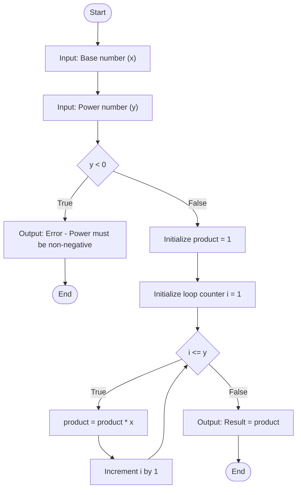

# Problem Analysis

The program computes the result of \( x^y \), where \( x \) is the base number and \( y \) is the power (exponent). It uses a loop to perform repeated multiplication.

1. **Inputs**:
   - Base number (\( x \)): An integer, can be positive, negative, or zero.
   - Power number (\( y \)): A non-negative integer.

2. **Processing**:
   - The program calculates the product by multiplying the base \( x \) by itself \( y \) times using a `for` loop that iterates \( y \) times.

3. **Outputs**:
   - The result of \( x^y \) (i.e., the value of \( x \) raised to the power \( y \)).

---

# Algorithm

1. **Start.**
2. Prompt the user for the base number (\( x \)) and the power number (\( y \)).
3. Check if \( y \) is a non-negative integer:  
   - If \( y < 0 \), display an error message and terminate the program.
4. Initialize `product = 1`.
5. If \( y > 0 \), iterate using a loop:
   - Multiply `product` by \( x \) (accumulate \( x \) multiplied by itself \( y \) times).
6. Display the result (`product`).
7. **End.**

---

# Flowchart

