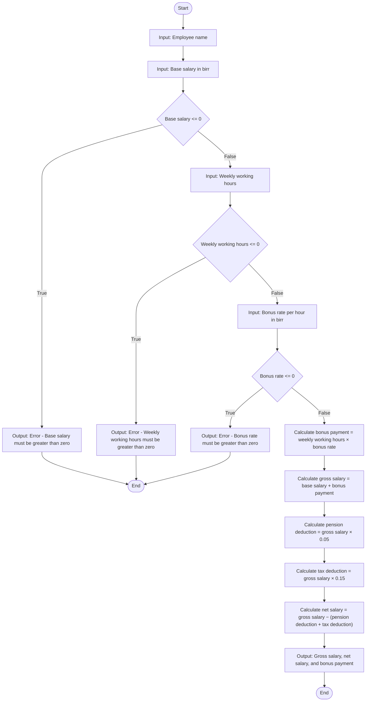

# Problem Analysis

The task is to calculate the gross salary, net salary, and bonus payment for an employee based on their input data.

1. **Inputs**:
   - `employee_name`: The name of the employee (a string).
   - `base_salary`: The base salary in birr (a positive double).
   - `weekly_working_hours`: The number of hours worked weekly (a positive double).
   - `bonus_rate_per_hour`: The bonus rate per hour in birr (a positive double).

2. **Processing**:
   - Validate inputs: Ensure `base_salary`, `weekly_working_hours`, and `bonus_rate_per_hour` are greater than zero.
   - Compute:
     - **Bonus Payment**: `bonus_payment = weekly_working_hours × bonus_rate_per_hour`
     - **Gross Salary**: `gross_salary = base_salary + bonus_payment`
     - **Deductions**:
       - Pension Deduction: `pension_deduction = gross_salary × 0.05`
       - Tax Deduction: `tax_deduction = gross_salary × 0.15`
     - **Net Salary**: `net_salary = gross_salary − (pension_deduction + tax_deduction)`

3. **Outputs**:
   - The employee's gross salary in birr.
   - The employee's net salary in birr.
   - The employee's bonus payment in birr.

---

# Algorithm

1. **Start.**
2. Prompt the user for:
   - `employee_name`
   - `base_salary`
     - If `base_salary <= 0`, display an error and terminate the program.
   - `weekly_working_hours`
     - If `weekly_working_hours <= 0`, display an error and terminate the program.
   - `bonus_rate_per_hour`
     - If `bonus_rate_per_hour <= 0`, display an error and terminate the program.
3. Compute:
   - `bonus_payment = weekly_working_hours × bonus_rate_per_hour`
   - `gross_salary = base_salary + bonus_payment`
   - `pension_deduction = gross_salary × 0.05`
   - `tax_deduction = gross_salary × 0.15`
   - `net_salary = gross_salary − (pension_deduction + tax_deduction)`
4. Display:
   - `employee_name`
   - `gross_salary`
   - `net_salary`
   - `bonus_payment`
5. **End.**

---

# Flowchart

