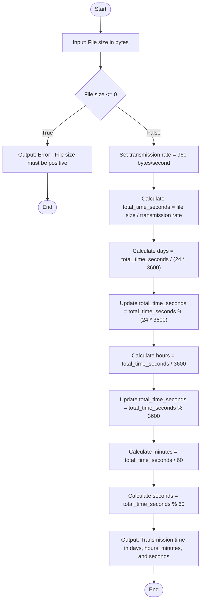

# Problem Analysis
The program calculates the time required to transmit a file over a network given a fixed transmission rate of 960 bytes per second. The result is expressed in days, hours, minutes, and seconds.

### 1. Input
The program requires the user to input:
- `file_size`: The size of the file in bytes (a positive number).
  - **Validation**: The file size must be greater than zero. If not, an error message is displayed, and the program terminates.

### 2. Processing
- **Calculate Total Transmission Time**: The transmission rate is 960 bytes per second.
- **Total Time in Seconds**: `total_time_seconds = file_size / transmission_rate`
- **Conversion to Days, Hours, Minutes, and Seconds**:
  - `Days = total_time_seconds / (24 × 3600)`
  - `Remaining seconds = total_time_seconds % (24 × 3600)`
  - `Hours = remaining_seconds / 3600`
  - `Remaining seconds = remaining_seconds % 3600`
  - `Minutes = remaining_seconds / 60`
  - `Seconds = remaining_seconds % 60`

### 3. Output
- **Time to transmit the file**: The program outputs the total time required for file transmission, broken down into days, hours, minutes, and seconds.

# Algorithm
1. Start.
2. Prompt the user to input the file size in bytes.
3. Validate Input: If `file_size <= 0`, display an error message and terminate the program.
4. Calculate Total Transmission Time in Seconds: `total_time_seconds = file_size / transmission_rate`
5. Convert Total Seconds to Days, Hours, Minutes, and Seconds:
   1. `Days = total_time_seconds / (24 × 3600)`
   2. Update `total_time_seconds = total_time_seconds % (24 × 3600)`
   3. `Hours = total_time_seconds / 3600`
   4. Update `total_time_seconds = total_time_seconds % 3600`
   5. `Minutes = total_time_seconds / 60`
   6. Update `total_time_seconds = total_time_seconds % 60`
6. Display the time in days, hours, minutes, and seconds.
7. End.

# Flowchart

