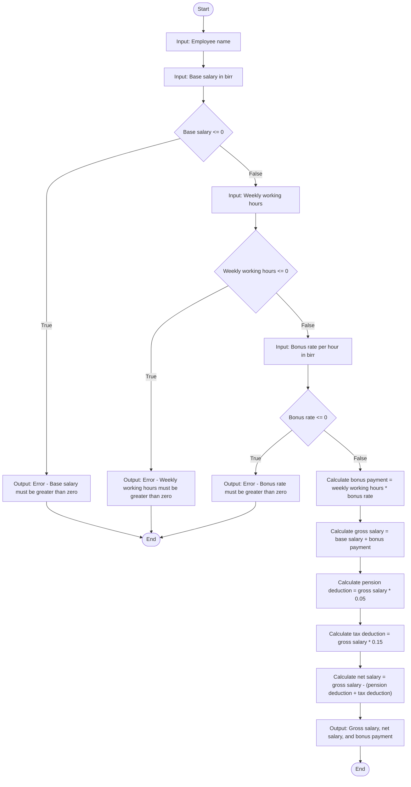

# Problem Analysis
The task is to calculate the gross salary, net salary, and bonus payment for an employee based on their input data. To achieve this, the program follows three main steps: Input, Processing, and Output.
Input:
employee_name: The name of the employee (a string).
base_salary: The base salary in birr (a positive double).
weekly_working_hours: The number of hours worked weekly (a positive double).
bouns_rate_per_hour: The bonus rate per hour in birr (a positive double).
Processing:
Validate that all inputs (base_salary, weekly_working_hours, bouns_rate_per_hour) are greater than zero. If not, display an error message and terminate the program.
Compute the bonus payment: bouns_payment = weekly_working_hours × bouns_rate_per_hour
Compute the gross salary: gross_salary=base_salary+bouns_payment
Calculate deductions:
Pension Deduction: pension_deduction = gross_salary × 0.05
Tax Deduction: tax_deduction = gross_salary × 0.15
Compute the net salary: net_salary = gross_salary − (pension_deduction+tax_deduction)
Output:
The employee's gross salary in birr.
The employee's net salary in birr.
The employee's bonus payment in birr.

# Algorithm
step 1: Start
step 2: Prompt the user to enter their name and store it in employee_name.
step 3: Prompt the user to enter the base salary.
    step 3.1: If the input is less than or equal to 0, display an error message and terminate the program.
step 4: Prompt the user to enter weekly working hours.
    step 4.1: If the input is less than or equal to 0, display an error message and terminate the program.
step 5: Prompt the user to enter the bonus rate per hour.
    step 5.1: If the input is less than or equal to 0, display an error message and terminate the program.
step 6: Calculate Bonus Payment: Multiply weekly_working_hours by bouns_rate_per_hour and store the result in bouns_payment.
step 7: Calculate Gross Salary: Add base_salary to bouns_payment and store the result in gross_salary.
step 8: Calculate Deductions:
  step 8.1: Compute pension deduction as 5% of gross_salary and store in pension_deduction.
  step 8.2: Compute tax deduction as 15% of gross_salary and store in tax_deduction.
step 9: Calculate Net Salary: Subtract pension_deduction and tax_deduction from gross_salary and store the result in net_salary.
step 10: Display the employee_name, gross_salary, net_salary, and bouns_payment.
step 11: End

# Flowchart

