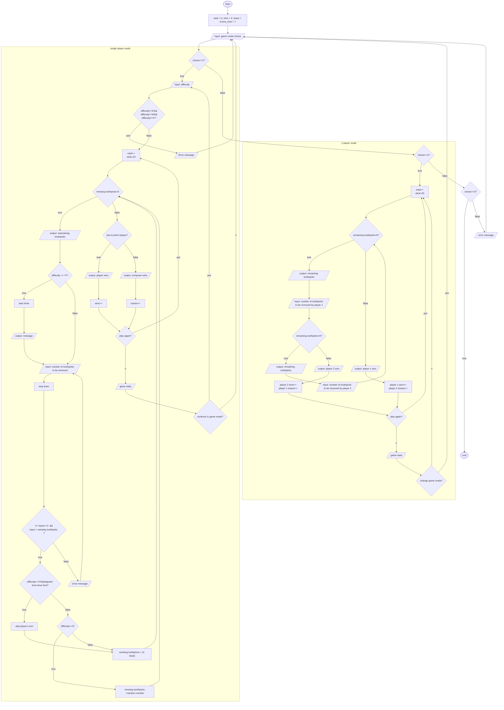

```mermaid
flowchart
id1([Start])-->id2[total = 0, wins = 0, loses = 0,time_limit = 7]
id2-->id3[/input: game mode choice/]
id3-->id4{choice==1?}

subgraph single player mode

id4--true-->id5[/input: difficulty/]
id5-->id6{difficulty!='E'&&
difficulty!='M'&&
difficulty!='H'?}
id6--ture-->id7[/Error message/]
id6--flase-->id8[total++
stick=23]
id8-->id23{remaing toothpicks>0}--true-->id9[/output: reamianing toothpicks/]
id9-->id12{difficulty == 'H'?}
id12--true-->id13[start timer]
id13-->id14[/output: message/]
id14-->id10[/input: number of toothpicks to be removed/]
id12--false-->id10
id10-->id19
id15--true----->id16[remaing toothpicks-=random number]
id15--false-->id17["remaing toothpicks-= (4-input) "]
id19[stop timer]------>id11{1<=input<=3  &&
input < remaing toothpicks ?}
id11--true-->id20{difficulty=='H'&&elapsed time>time limit?}
id20--true-->id21[skip player's turn]
id21-->id17
id20--false-->id15{difficulty=='E'}
id22-->id10
id11--false-->id22[/error message/]
id17-->id23
id16-->id23
id23--false-->id24{last to pick!=player?}
id24--true-->id25[/output :player wins/]
id25-->id26[wins++]
id24--false-->id27[/output :computer wins/]
id27-->id28[losses++]
id28-->id31{play again?}
id31--yes-->id8
id26-->id31
id31--no-->id50[/game stats/]
id50-->id34{continue in game mode?}
id34--yes-->id5

end

subgraph 2 player mode

id4--false---->id35{choice==2?}
id35--true-->id36[total++
stick=23]
id36-->id37{remaining toothpicks>0?}
id37--ture-->id38[/output: remaining toothpicks/]
id38-->id39[/input: number of toothpicks to be removed by player 1/]
id39-->id40{remaining toothpicks>0?}
id40--true-->id41[/output: remaining toothpicks/]
id41-->id42[/input: number of toothpicks to be removed by player 2/]
id42-->id37
id37--flase-->id43[/output: player 1 won/]
id43-->id44[player 1 wins++
player 2 losses++]
id40--false-->id45[/output: player 2 won/]
id45-->id46[player 2 wins++
player 1 losses++]
id46-->id47{play again?}
id44-->id47
id47--yes-->id36
id48--no-->id36
id47--no-->id49[/game stats/]
id49-->id48{change game mode?}

end

id48--yes-->id3
id7-->id3
id34--no-->id3
id51--true---------->id52([end])
id35--false-->id51{choice==3?}

id51--flase-->id53[/error message/]
id53-->id3
```
