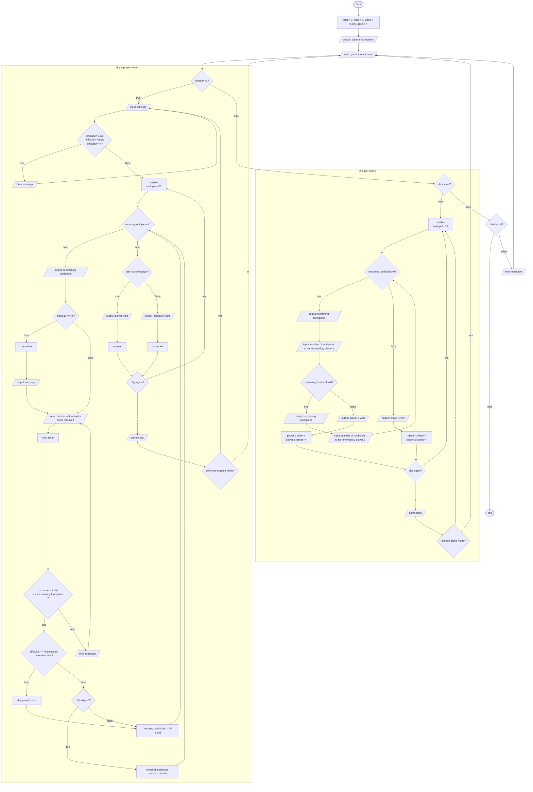

# Problem Analysis

## Inputs

1. `decision`.
2. `game_mode`choice.
3. `difficulty`choice.
4. number of `toothpick`s to be removed by `player`.

## Outputs

1. remaining `toothpick`s with pattern.
2. number of `wins`.
3. number of `losses`.
4. number of `rounds` played.

## Operations

1.  Prompt user to enter their `game_mode` choice.

    1.1. If `game_mode`>3 or `game_mode`<1, output error message and goto 1.

2.  If game_mode==1, start single player mode and Prompt user to chose the `difficulty` else goto 7.

    2.1.If `difficulty!='H'`and`difficulty!='M'`and`difficulty!='E'` ,output error message and goto 2.

    2.2. Display the remaining `toothpicks`.

    2.3. Prompt `player` to enter the number of `toothpicks` to be remove.

        2.3.1. if `difficulty=='H'`, output message "you have 5 seconds to enter a number"and start `timer`.

        2.3.2. If `player` >3 or `player` <1, output error message and goto 2,3.

        2.3.3. After `player` enters a valid input stop `timer`.

        2.3.4. If `elapsed_time`>`time_limit`,skip `player`'s turn.

    2.4. Remove `toothpicks` based on `difficulty`.

        2.4.1.If `difficulty`=='H' or `difficulty`=='M', remove `(4-player)` `toothpick`s.

        2.4.2. Else remove a random number of `toothpick`s

    2.5. check remaing `toothpick`s

        2.5.1 if remaining toothpicks>0 goto 2.2 else declare winner.

            2.5.1.1. if player picked the last toothpick, computer wins and increment losses by 1. else player wins and increment wins by 1.

    2.6. prompt `player` to decide if they want to play again

        2.6.1. if `yes`, toothpicks=23 and goto 2.2.else display player stats.

    2.7. prompt `player` to decide if they want to change game mode.

        2.7.1. if `yes`, goto 1, else goto 2.

3.  If game_mode==2, start 2-player mode. else goto 4

    3.1. `toothpick` =23

    3.2. Display remaining `toothpick`s

    3.3. Prompt `player1` to enter the number of `toothpicks` to be removed.

        3.3.1. If `player` >3 or `player` <1, output error message and goto 3.3.

        3.3.2. toothpick-=player1.

        3.3.3. if remaining toothpicks<=0, goto 3.7.

    3.4. Display remaining `toothpick`s

    3.5. Prompt `player2` to enter the number of `toothpicks` to be removed.

        3.5.1. If `player` >3 or `player` <1, output error message and goto 3.5.

        3.5.2. toothpick-=player2.

        3.5.3. if remaining toothpicks<=0, goto 3.7.

    3.6. Display remaining `toothpick`s

    3.7. declare the winner

        3.7.1. if `player1` picked the last `toothpick`

            3.7.1.1. player2 wins++

            3.7.1.2. player1 losses++

        3.8.2. if `player2` picked the last `toothpick`

            3.8.2.1. player1 wins++

            3.7.2.1. player2 losses++

    3.8. prompt `player` to decide if they want to play again

        3.8.1. if `yes`, goto 3.1., else display player stats.

    3.9. prompt `player` to decide if they want to change game mode.

        3.9.1. if `yes`, goto 1, else goto 3.

4.  if game_mode==3, terminate the program, else display error message and goto 1.

# Pseudocode

## Step 1: Start
- Initialize variables:
  - `total = 0`
  - `wins = 0`
  - `losses = 0`
  - `time_limit = 7`

## Step 2: Display Instructions
- Display the game instructions and the initial pattern.

## Step 3: Input Game Mode
- Prompt the user to choose a game mode (`game_mode`).
- **Options**:
  - 1: Single Player Mode
  - 2: Two Player Mode
  - 3: Exit the Program

## Step 4: Validate Game Mode
- If `game_mode` is not 1, 2, or 3, display an error message and go back to Step 3.

## Step 5: Single Player Mode (`game_mode == 1`)

### Step 6: Input Difficulty
- Prompt the user to choose a difficulty (`difficulty`).
- **Options**:
  - `E`: Easy
  - `M`: Medium
  - `H`: Hard
- If the difficulty is invalid, display an error message and go back to Step 6.

### Step 7: Initialize Game
- Set `total += 1`, `sticks = 23`.

### Step 8: Game Loop
- **While** `remaining toothpicks > 0`
  - Display the remaining toothpicks.

### Step 9: Handle Difficulty (Hard Mode)
- If `difficulty == 'H'`:
  - Output: "You have 5 seconds to enter a number".
  - Start a timer.
  - Input: Prompt the player to enter the number of toothpicks to remove.
  - Check if elapsed time exceeds `time_limit`. If so, skip the player's turn.

### Step 10: Handle Difficulty (Medium or Easy Mode)
- If `difficulty == 'M'` or `difficulty == 'E'`:
  - Prompt the player to enter the number of toothpicks to remove.

### Step 11: Validate Player Input
- Ensure the input is valid:
  - `input >= 1` and `input <= 3`
  - `input <= remaining toothpicks`
- If invalid, display an error message and go back to Step 10.

### Step 12: Remove Toothpicks Based on Difficulty
- If `difficulty == 'H'` or `M`:
  - `remaining toothpicks -= (4 - input)`
- Else:
  - `remaining toothpicks -= random number`

### Step 13: Check Game Status
- If `remaining toothpicks <= 0`:
  - Check if the player picked the last toothpick:
    - If the player did, output: "Player wins", increment `wins`.
    - Otherwise, output: "Computer wins", increment `losses`.

### Step 14: Play Again?
- Prompt: Do you want to play again?
  - If yes, set `remaining toothpicks = 23` and go back to Step 8.
  - If no, go to Step 15.

### Step 15: Change Game Mode?
- Prompt: Do you want to change the game mode?
  - If yes, go to Step 3 (game mode choice).
  - If no, display game stats and go to Step 18.

## Step 16: Two Player Mode (`game_mode == 2`)

### Step 17: Initialize Game
- Set `remaining toothpicks = 23`.

### Step 18: Game Loop
- **While** `remaining toothpicks > 0`
  - Display remaining toothpicks.

### Step 19: Player 1 Turn
- Prompt Player 1 to enter the number of toothpicks to remove.
- Validate input (1-3, and not more than remaining toothpicks).
- Update the remaining toothpicks: `remaining toothpicks -= player1 input`.

### Step 20: Check Game Status After Player 1's Turn
- If `remaining toothpicks <= 0`, Player 2 wins. Increment `player2 wins`, `player1 losses`. Go to Step 21.

### Step 21: Player 2 Turn
- Prompt Player 2 to enter the number of toothpicks to remove.
- Validate input (1-3, and not more than remaining toothpicks).
- Update the remaining toothpicks: `remaining toothpicks -= player2 input`.

### Step 22: Check Game Status After Player 2's Turn
- If `remaining toothpicks <= 0`, Player 1 wins. Increment `player1 wins`, `player2 losses`. Go to Step 21.

### Step 23: Play Again?
- Prompt: Do you want to play again?
  - If yes, go back to Step 17.
  - If no, go to Step 24.

### Step 24: Change Game Mode?
- Prompt: Do you want to change the game mode?
  - If yes, go to Step 3 (game mode choice).
  - If no, display game stats and go to Step 18.

## Step 25: Exit Program (`game_mode == 3`)
- Terminate the program.

## Step 26: Invalid Game Mode
- If `game_mode` is not valid, display an error message and go back to Step 3.
# Flowchart

# Documentation
https://docs.google.com/document/d/1dkMeazyiF60wFfgh2_ntTJ6m2Htjjt08raVrbn2R8P0/edit?usp=sharing
